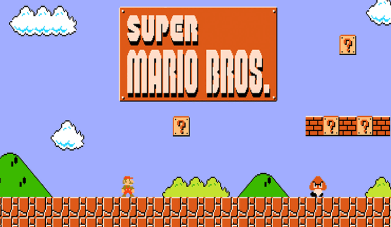

# Super Mario Web

El objetivo de este ejercicio, es crear una pantalla como la de la imagen img/resultado.png en formato web con divs y imagenes, colocadas en el sitio más exacto posible con position:absolute.

La pantalla tiene que medir 900px de ancho y los que consideréis de alto.

Intentad replicar lo mejor posible la imagen resultado.png sin usar, por supuesto la imagen resultado.png.

Las cajas y algunos elementos, tienen una pequeña sombra. Intentad replicarla con CSS.

Para las cajas, podeis jugar con el hover, para que cuando pases el ratón por encima, se vuelva transparente con el opacity y se vea la sorpresa que pongáis debajo. Creatividad ;-)

Haced alguna animación con el cartel, el SuperMario o con lo que queráis con los recursos web vistos en clase.

# Entrega

Entregar la tarea, a ser posible en github. Sino, entregar la tarea en un ZIP por la moodle con el nombre:

ApellidosNombre_SuperMarioWeb.zip.

